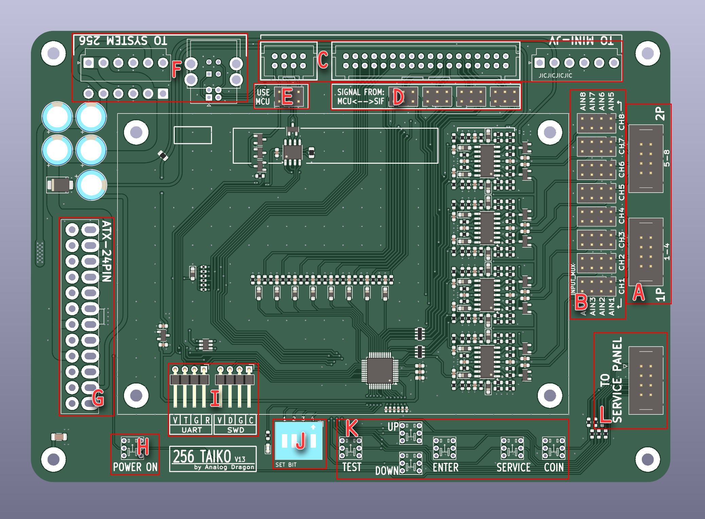
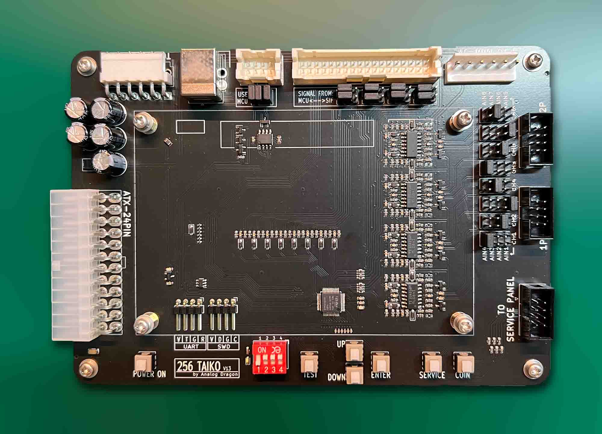

# Taiko-256
 Taiko JVS for Namco System 256 (246)  
  
因为在此之前要使用Namco System 256运行太鼓，需要很多配件，比如说需要一块JVS(MINI-JV PCB)，一块SIF PCB，还需要中间的FUTA PCB，过于复杂。  
本项目的PCB可以完全代替上面三块板，它具有两个独立的Taiko接口，有板载的Service按键，并且支持ATX电源直接供电。  
当然也可以通过本项目的PCB只代替SIF PCB和FUTA PCB，仍旧使用原始的MINI-JV PCB。不过这并不能带来更好的体验。
  
## PCB：  

  

**图片内字母标注：**  
- **A**：Taiko传感器的接口，通道1\~4为player1，通道5\~8为player2，需要连接带有震动传感器的Taiko（靠近板边的排针用于接地）。  
- **B**：Taiko传感器输入交换矩阵，可以通过在不同的地方放置跳线帽，来让输入映射到任意的通道。  
- **C**：用于连接MINI-JV的接口，可以not connected。  
- **D**：用于连接MINI-JV时，决定鼓信号来自MCU还是SIF，可以not connected。  
- **E**：需要在排针上纵向短接3个短接冒来使用。如果连接了MINI-JV，则去掉三个短接冒  
- **F**：连接到System 256的接口，可以焊接直插或侧插的连接器（注意千万不要焊错位置）。数据通信需要准备一根USB-A to USB-B的连接线缆，System 256供电需要准备一根VH3.96-6Pin双头反向线缆。  
- **G**：ATX电源接口，可以焊接直插或侧插的连接器。  
- **H**：电源开关（需要自锁开关），按下后启动ATX电源。  
- **I**：used for debug.  
- **J**：配置码（从左至右为1234位）：
  - **1**：debug开关（使用时设置为OFF）  
  - **2**：频率限制开关（因为System的输入无法太快，使用时设置为ON）  
  - **3**：DON的自动分配（如果左侧的DON击打多次，可能会因为System256机能无法识别过多的输入，此时将其分配到右侧的通道，可以优化体验，建议设置为ON）  
  - **4**：JVS功能（需要设置为ON。如果用于连接MINI-JV则设置到OFF）  
- **K**：Service功能按键。其中TEST需要自锁开关，其他的需要非自锁开关。  
- **L**：用于连接Service控制面板的连接器，如果有需要将Service按键引出到其他面板，可以通过此连接器。  
  
  
### 实物图： 
  
  
  
