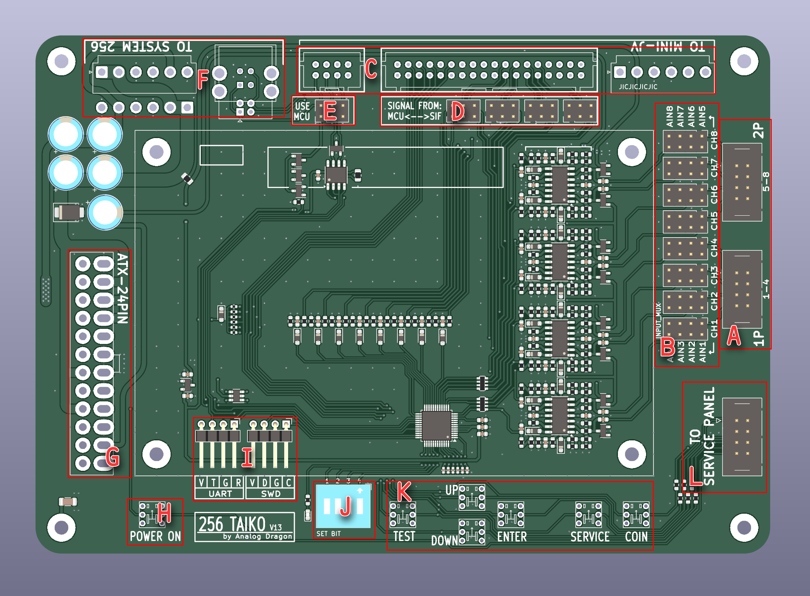
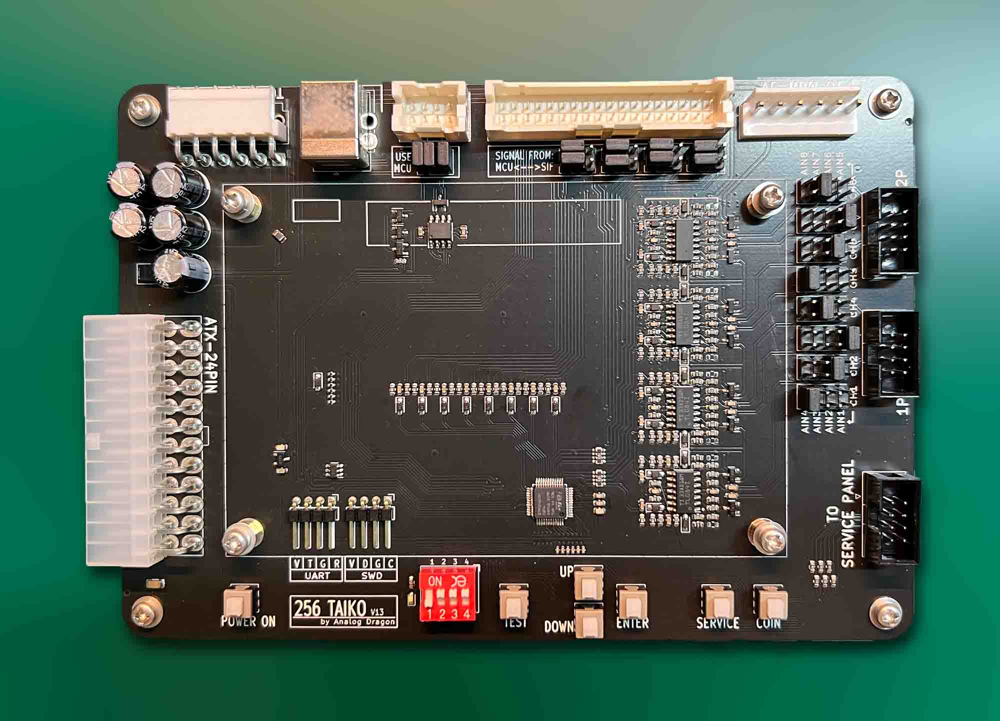
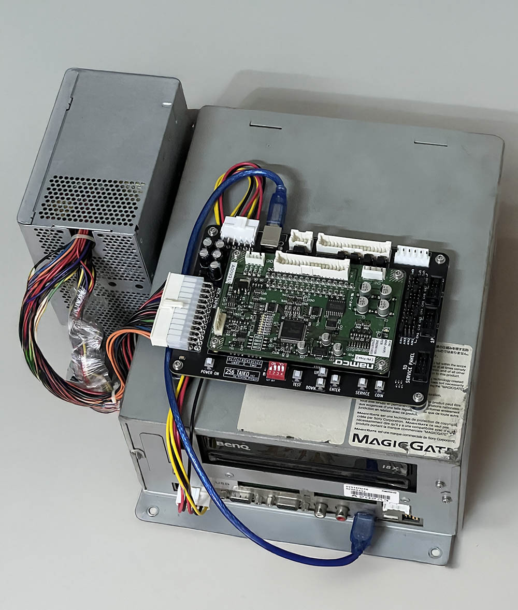

# Taiko-256  
Taiko JVS for Namco System 256 (246)  

Previously, running Taiko on Namco System 256 required many accessories, such as a JVS (MINI-JV PCB), a SIF PCB, and an intermediate FUTA PCB, making the setup overly complex.  
This project's PCB can fully replace the three boards mentioned above. It features two independent Taiko interfaces, an onboard Service button, and supports direct power supply via ATX.  
Alternatively, this PCB can also be used to replace only the SIF PCB and FUTA PCB while still using the original MINI-JV PCB. However, this does not provide a better experience.  

## PCB:  

  

**Labels in the image:**  
- **A**: Taiko sensor interface. Channels 1\~4 are for Player 1, and channels 5\~8 are for Player 2. Requires connection to a Taiko with vibration sensors (the pins near the board edge are for grounding).  
- **B**: Taiko sensor input swap matrix. Jumpers can be placed in different positions to map inputs to any channel.  
- **C**: Interface for connecting to MINI-JV (can be left unconnected).  
- **D**: When connecting to MINI-JV, determines whether drum signals come from the MCU or SIF (can be left unconnected).  
- **E**: Requires three jumpers to be vertically shorted. If MINI-JV is connected, remove all three jumpers.  
- **F**: Interface for connecting to System 256. Either vertical or right-angle connectors can be soldered (ensure correct placement). For data communication, a USB-A to USB-B cable is required. For System 256 power, a VH3.96-6Pin double-ended reverse cable is needed.  
- **G**: ATX power connector. Either vertical or right-angle connectors can be soldered.  
- **H**: Power switch (requires a latching switch). Press to activate the ATX power supply.  
- **I**: Used for debug.  
- **J**: Configuration code (from left to right, digits 1~4):  
  - **1**: Debug switch (set to OFF during use).  
  - **2**: Frequency limiter switch (set to ON during use, as the System cannot handle overly fast inputs).  
  - **3**: Automatic DON allocation (if the left DON is hit multiple times, System 256 may fail to recognize excessive inputs. Allocating it to the right channel improves the experience. Recommended: ON).  
  - **4**: JVS function (set to ON. Set to OFF if connecting to MINI-JV).  
- **K**: Service function buttons. TEST requires a latching switch, while the others require momentary switches.  
- **L**: Connector for linking to a Service control panel. If the Service buttons need to be extended to another panel, this connector can be used.  

### PCB Image:  
  
  
